**_NOTE: THE CHALLENGE IS STILL ONGOING. I WILL CONTINUOUSLY UPDATE THIS REPOSITORY AS I MAKE PROGRESS_**

# 30DaysDuckDBChallenge

 

## Introduction 
I'm absolutely thrilled to embark on this exciting journey of data exploration and analysis with DuckDB in conjunction with MotherDuck. The **#30DaysDuckDBChallenge** represents a unique opportunity for me to dive headfirst into the world of data, unlocking valuable insights and honing my skills using DuckDB, a robust database management system.

Over the next 30 days, I'll be on an adventure, delving into diverse datasets and refining my abilities in data manipulation, querying, and analysis. With DuckDB, I'm eager to make sense of data and draw meaningful conclusions.

This repository serves as my central hub for all things related to this challenge. Here, I'll share tasks, queries, visuals and insights discovered from the dataset. It's a golden opportunity for me to push my boundaries, experiment with the FIFA2021 datasets, and relish the excitement of uncovering hidden patterns and insights within the datasets.

## Dataset
The dataset for the **#30DaysDuckDBChallenge** consists of two FIFA 2021 datasets, both provided in CSV format. These datasets are comprehensive and rich, containing detailed information about football players, including their attributes, club affiliations, and performance statistics. They offer an excellent opportunity for me to sharpen my data analysis skills and extract valuable insights while tackling the challenge's tasks. The FIFA 2021 dataset is the perfect companion for this data exploration journey. [Dataset_1](https://github.com/Geephted/30DaysDuckDBChallenge/blob/main/fifa21_raw_data.csv), [Dataset_2](https://github.com/Geephted/30DaysDuckDBChallenge/blob/main/fifa21_raw_data_v2.csv).

## Tools
DuckDB and Power BI are the dynamic duo of the **#30DaysDuckDBChallenge**. DuckDB, a high-performance analytical database, is our data engine, powering the analysis and insights throughout the challenge. It's where our data comes to life and reveals its stories.

Complementing DuckDB is Power BI, our visualization powerhouse. With its interactive and visually appealing reports and dashboards, Power BI transforms data into meaningful insights, making them accessible and actionable. Together, DuckDB and Power BI are our tools of choice for this exciting data exploration journey.

## Day 1: Getting Started 
To kickstart the **#30DaysDuckDBChallenge** journey, i started by creating a Motherduck account and becoming part of the Motherduck community. Next, I install DuckDB and set it up on my local machine. I also make sure to install Power BI on my computer and configure it to be ready for action. As I make progress, I share my updates on Twitter and LinkedIn, posting a screenshot of my Motherduck account. This is where the adventure begins
 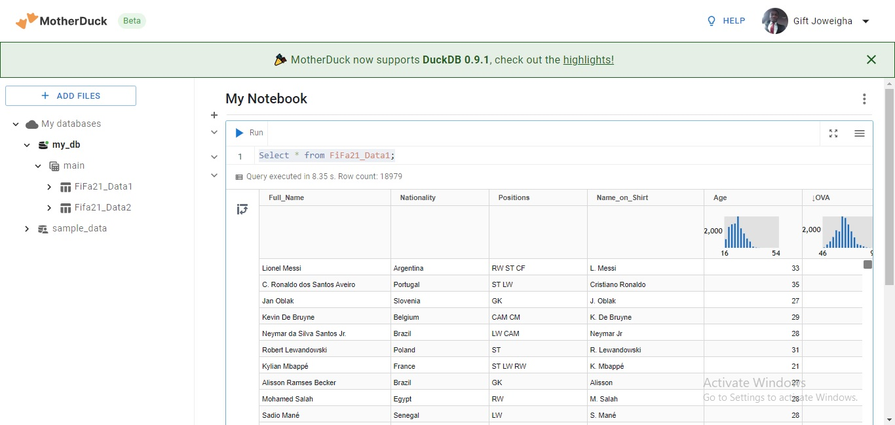

## Day 2: Database Creation 
The next step is to create a DuckDB database named "**challenge**." I loaded the two FIFA dataset files into DuckDB. With my data securely loaded into DuckDB, I connected my DuckDB with Motherduck, our collaborative platform. This connection will make it easier for a third party with the shared link to explore the data efficiently. Then, I shared my progress, as it is encouraged, enhancing the collaborative and enriching learning experience.

## Day 3-5: Data Cleaning 
To ensure data accuracy, consistency, and integrity, I conducted the following procedures to clean the dataset:
- 1. Converting Height and Weight to Numerical Form
      One of the primary tasks was to convert the 'Height' and 'Weight' columns to a numerical format.

     For '**Height**': I ensured that the 'Height' column values were consistently presented in a numerical format. For example, '6'0"' was converted to '6', removing the unnecessary             strings

      For '**Weight**': I removed the "lbs" from the 'Weight' column and converted it into a pure numerical format.

- 2. Converting 'Value,' 'Wage,' and 'Release Clause' to Numbers
      Another significant task was dealing with columns containing monetary values, such as 'Value,' 'Wage,' and 'Release Clause.'

      For '**Value**': The 'Value' column contained values in the format '€100M' (indicating 100 million) and '€10K' (indicating 10,000). To transform this, i stripped away the 		currency symbol ('€') and units ('M' for million and 'K' for thousand) to reveal the true numerical values. This transformation allows for accurate financial analysis.

      For '**Wage**': The 'Wage' column also included units in the form of 'K' (e.g., '€100K'). I converted these values to thousands, making them suitable for financial analysis.

      For 'Release Clause': Similar to 'Wage,' the 'Release Clause' column included units like 'M' and 'K.' these units were removed, and the data was converted to numbers.

- 3. Handling '**Star**' Characters
      In some columns, i encountered 'star' characters that needed to be removed. This was done systematically to ensure the columns only contained numerical values. This step was             essential to enable a clean and unambiguous dataset for further analysis.

- 4. I enhanced the dataset structure by renaming few columns
 
     This is the appearance of the dataset after undergoing thorough cleaning.
      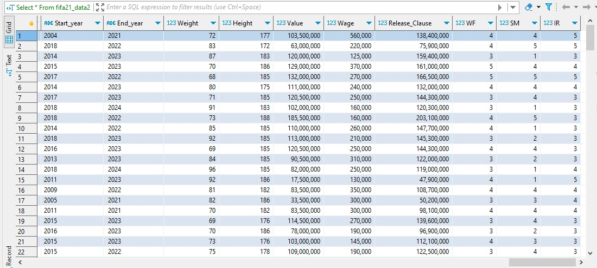

## Day 6-7: Analysis 
I successfully completed the first set of data analysis tasks for this journey, gaining profound insights into the FIFA 2021 dataset. These tasks involved thorough exploration of player data, leveraging DuckDB's analytical capabilities. This report outlines my findings and key takeaways from each of the four completed tasks the thier SQL queries.
 
1.  **Identifying High-Value, Low-Wage Players** My analysis has revealed players in the dataset with substantial market value yet receiving relatively low wages. This task has provided me with a better understanding of undercompensated assets, opening opportunities for potential player negotiations and highlighting market inefficiencies.

2. **Player Count by Position**: Determining player counts for each position within the dataset was pivotal in comprehending the distribution of roles in the football world. This analysis has afforded me an extensive overview of the diversity and abundance of player positions.

3. **Club with Largest Player Representation**. Exploring which club boasts the most substantial representation of players in the dataset has given me valuable insights into clubs' sizes and their global player recruitment strategies.
   
4. **Top 10 Players by OVA and POT** In the final task, I compiled a list of the top 10 players with the highest Overall (OVA) and Potential (POT) values. This ranking has uncovered standout players and potential rising stars in the realm of football.

## Day 8-9: Analysis 
Additional tasks were assigned to gain further insight into the dataset, offering responses to specific queries and delving deeper into players statistics and characteristics. Here's an overview of my achievements:

1. **Identifying Players with the Highest OVA and POT Within Each Club**: I initiated my analysis by employing the Rank function to uncover players with the highest OVA and POT in each club. This process enabled me to precisely identify the top-performing players within every club. Through the ranking of players according to their OVA and POT, I achieved a more distinct grasp of excellence within the dataset.

2. **Calculating the Average OVA for Different Age Groups in Each Club**: I harnessed the Case statement and rounded up the average figures to explore the variations in player performance concerning age. This involved computing the average OVA for players under 25 years old and those over 30 years old in each club. Through this analysis, I deepened my comprehension of age dynamics within various clubs.

3. **Listing Players with the Same Age within Each Club: My next task involved identifying players who share the same age within each club**. Leveraging the Array function, my analysis unveiled groupings of players within clubs who share the same age. This insight sheds light on possible recruitment strategies or the prevalence of specific age groups within the club.
   
4. **Finding the Player with the Highest POT for Each Nationality**: Employing the Rank function, I delved into player nationalities, identifying the player with the highest POT for each nationality. This analysis unveiled standout players from various nationalities, offering valuable insights for international comparisons.
 
5. Ranking Players by OVA in Descending Order within Each Club: Utilizing the Dense Rank function, I systematically ranked players by their OVA in descending order within each club. This ranking provided a clear view of the hierarchy of player performance within individual clubs, offering valuable insights into team strengths and standout players.

## Day 11 -12: Visualisation
We have now entered the second stage of the challenge, where we continue to utilize the FIFA21 Dataset. In this phase, we're delving into the importance of data visualization for extracting practical insights from intricate datasets, highlighting the capabilities of Power BI's prowess through the following tasks;

**Task 1: Nationality Distribution:** Create a bar chart that displays the distribution of players' nationalities.
Allow users to filter by nationality to see players from specific countries.

**Task 2: Age vs. Potential:** Build a scatter plot that explores the relationship between a player's "Age" and "POT" (potential).
Add a trendline to visualize the trend between age and potential.

**Task 3: Player Position Analysis:** Generate a pie chart showing the distribution of player positions ("Positions" column).
Make the chart interactive so users can select a position to view players with that role.

**Task 4: Top Players by Overall Rating:** Create a table that lists the top players based on their "OVA" (overall rating) in descending order.
Allow users to filter by a specific club to see its top-rated players.

Interactive Dashboard:
 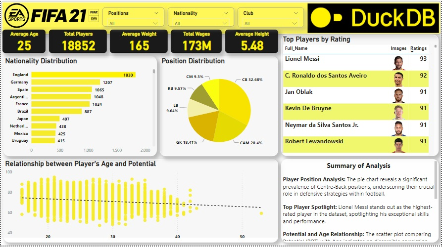

### Summary of Insight:

**Player Position Analysis:** The pie chart reveals a significant prevalence of Centre-Back positions, underscoring their crucial role in defensive strategies within football.

**Top Player Spotlight:** Lionel Messi stands out as the highest-rated player in the dataset, spotlighting his exceptional skills and performance.

**Potential and Age Relationship:** The scatter plot comparing Potential (POT) with Age indicates no discernible correlation. As players age, their potential ratings don't follow a consistent pattern, suggesting age might not significantly determine potential in this dataset.

**Global Player Diversity:** The count of players by nationality showcases diverse representation from various countries, emphasizing the extensive global presence within FIFA and the sport's diverse talent pool.

## Day 13 - 16 Reading "DuckDB in Action" and Watching some Recommended Videos.
Continuing the #30DaysDuckDBChallenge with DuckDB, I expanded my knowledge through recommended videos, pre-reading, and exploring "DuckDB in Action." The book proved to be a genuine eye-opener, delivering a remarkably enlightening experience. It commenced with a concise introduction to DuckDB, offering detailed insights into its essence and capabilities.

DuckDB, a formidable force in data analytics, seamlessly integrates with CLI operations, cloud data pipelines, and Python coding. Its remarkable versatility extends to handling various file formats and databases, both locally and remotely, encompassing CSV, JSON, Parquet, and Arrow. The compatibility with databases like MySQL, SQLite, and Postgres further underscores DuckDB's adaptability.

A standout feature of DuckDB is its vectorized query engine, ensuring rapid and cost-effective data analysis. The engine's efficiency in accessing data directly from diverse sources eliminates the need for superfluous data transfers. DuckDB proves to be platform-agnostic, effortlessly adapting to various operating systems, making it a versatile companion regardless of the platform.

The accompanying book provides valuable insights into practical scenarios, offering guidance on leveraging DuckDB judiciously. It furnishes a comprehensive list for data structure enthusiasts, equipping them with tools for efficient navigation, including commonly used Dot commands.
Shifting focus to queries, the emphasis is on the ease of performing SQL queries, whether through CLI configuration or Python app embedding. The book provides a thorough walkthrough of Data Manipulation Language (DML) queries and clauses, such as JOIN and WITH, with illustrative examples for easy understanding.

In essence, DuckDB transcends its identity as a mere tool; it signifies a mindset shift, streamlining data analysis into a faster, simpler, and cost-effective process. The book serves as a guide, demonstrating effective ways to leverage DuckDB in projects.

In the practical application and continuation of the challenge, I seamlessly uploaded the Titanic datasets onto DuckDB. Notable details include 891 passengers in the train dataset, 418 rows in the test dataset, and the absence of the "Survived" column in the test dataset, all in CSV format. Paying meticulous attention to these details became crucial as I familiarized myself with every nook and cranny of the datasets.

## Day 17 & 18: Advanced SQL Techniques
Just sailed through a fascinating data exploration with the Titanic dataset in the ongoing #30DaysDuckDBChallenge with DuckDB. Immersing myself in Advanced SQL techniques using the CTE and Windows Functions, Below a snapshot of the findings on survival rates, gender distinctions, and age correlations.

**Question 1: Fare vs. Survival Rates** 

I utilized the NTILE window function to evenly bucket passengers based on fare into 6 bins. Calculated statistics for each bin, shedding light on survival rates. Intriguingly, observed potential correlations between fare amounts and survival. The journey through the fare landscape revealed compelling insights. After successfully writing and executing the query, the screenshot below displays the query's results.

 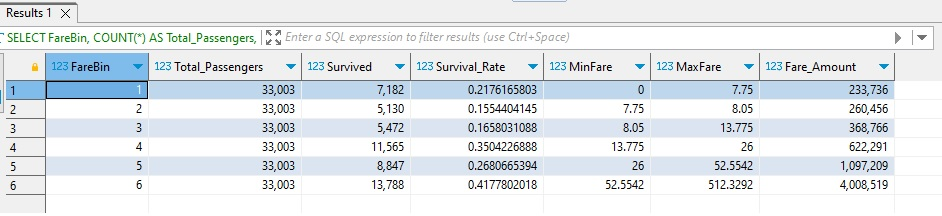

**Question 2: Gender Disparities in Survival Rates** 

I conducted a meticulous analysis of survival rates based on gender, employing CTE for a nuanced perspective. Calculated the percentage of passengers who survived, emphasizing the stark distinctions between males and females. Unearthed noteworthy differences in survival ratios, providing valuable insights into the impact of gender. After successfully writing and executing the query, the screenshot below displays the query's results.

 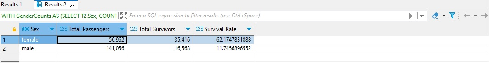

**Question 3: Age and its Role in Survival** 

I explored the intricate relationship between age and survival rates. Calculated survival rates for different age groups, unraveling intriguing patterns and trends. The analysis offered a glimpse into how age correlates with the likelihood of survival. As the Titanic's story unfolded, age emerged as a crucial factor influencing passengers' destinies. After successfully writing and executing the query, the screenshot below displays the query's results.

 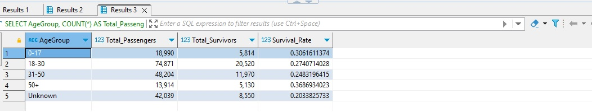

Embarking on this analytical journey through the Titanic dataset was not just a voyage through numbers; it was a dive into the stories of those aboard. Every insight gained adds another layer to the narrative of this historic event.

## Day 19 & 20: Advanced SQL Techniques
In the fascinating world of data exploration, we continued in the #30DaysDuckDBChallenge journey with DuckDB to uncover insights from the Titanic dataset. Here are two questions we delved into:

**Question 1: Understanding Titles and Survival Rates**

a. Identifying Unique Titles: I parsed through the 'Name' column, extracting unique titles. Understanding the diverse titles passengers held adds richness to our analysis.

 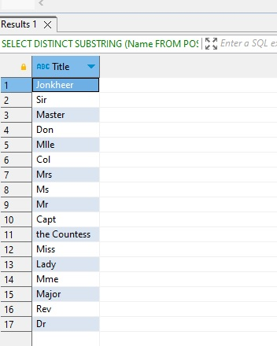
 
b. Consolidating Titles: To simplify our analysis, i grouped infrequent titles into broader categories. This consolidation included labels like 'Mr,' 'Mrs,' 'Miss,' and 'Master’, ‘Dr’, ‘Major’ and many others. This step provides a clearer picture of passenger demographics.

 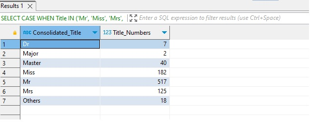

c. Calculating Survival Rates: Crunching the numbers, I calculated survival rates for each title grouping. This enables me to discern patterns in the likelihood of survival based on social titles.

 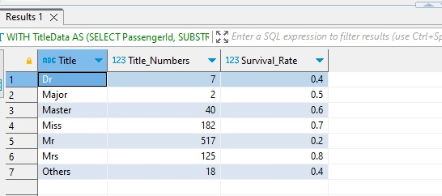

**Question 2: Calculating Survival based on Gender and Age**

For our second question, I took a binary approach, evaluating survival based on being a woman/child or an adult man.

 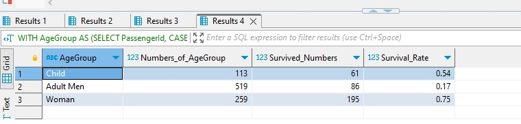

**Here are my findings:**

•	Child and Women Survival Rates: My analysis revealed higher survival rates among children and women. This aligns with the well-known maritime principle of "women and children first."

•	Insights into Titles: Uncovering survival rates based on titles sheds light on societal norms and expectations during the Titanic tragedy. This analysis provides a nuanced understanding of survival dynamics.

**Key Takeaways:**

•	Social status, as indicated by titles, played a role in survival outcomes.

•	The binary feature of being a woman/child correlated with higher survival rates.

## Day 21 - 23: Advanced SQL Techniques
Just wrapped up incredible tasks in the #30DaysDuckDBChallenge with DuckDB, showcasing my proficiency in SQL and data analysis. Here are the highlights of the tasks:

**Task 1: Survival based on Cabin Level**

Wrote an SQL query to unveil the survival rates, the number of passengers, and their corresponding cabin levels.

**Assumption:** Passengers with the same ticket number traveled together. 

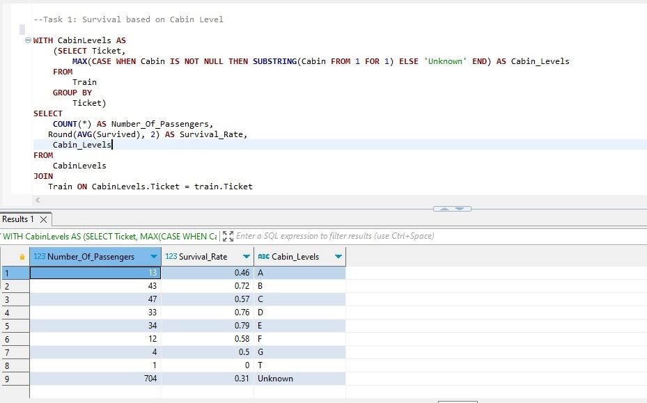

**Task 2: Solo Travelers, Family Travelers, and Mix Group**

I wrote a query to categorize passengers into solo travelers, family travelers, and mixed groups.

**Assumption:** Solo travelers are those with a unique ticket, and families may span across different tickets. 

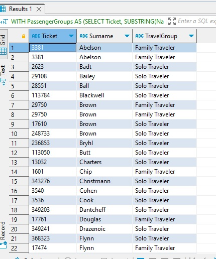

**Task 3: Family Size Calculation**

Crafted an SQL query to determine family sizes, accounting for SibSp, ParCh, and the current passenger (+1). Family size was determined at the maximum based on ticket number and surname.

**Assumption:** Families traveled together on the same ticket.

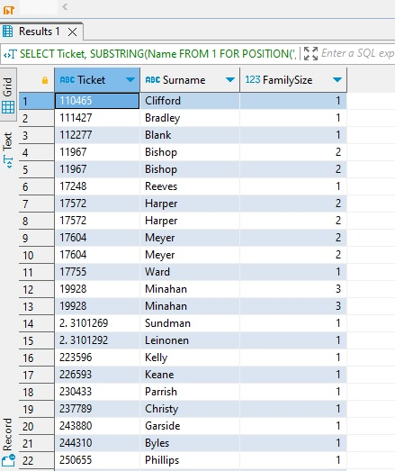

These tasks were intense, with rich learnings in querying and creative problem-solving. Special shoutout to DuckDB for providing a robust platform to explore these complex tasks.

**Lessons Learned:**

- Precision in crafting SQL queries is key.
- Assumptions play a crucial role in problem-solving – define and validate them.
- DuckDB's performance is truly impressive for analytical workloads.

Grateful for the opportunity to dive deep into DuckDB's capabilities and share insights. Excited for the next task!

