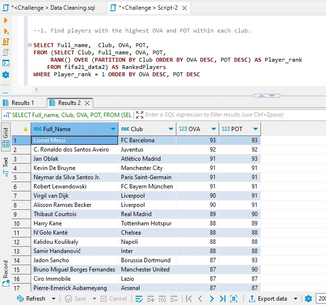

# 30DaysDuckDBChallenge

## Introduction 
I'm absolutely thrilled to embark on this exciting journey of data exploration and analysis with DuckDB in conjunction with MotherDuck. The **#30DaysDuckDBChallenge** represents a unique opportunity for me to dive headfirst into the world of data, unlocking valuable insights and honing my skills using DuckDB, a robust database management system.

Over the next 30 days, I'll be on an adventure, delving into diverse datasets and refining my abilities in data manipulation, querying, and analysis. With DuckDB, I'm eager to make sense of data and draw meaningful conclusions.

This repository serves as my central hub for all things related to this challenge. Here, I'll share tasks, queries, visuals and insights discovered from the dataset. It's a golden opportunity for me to push my boundaries, experiment with the FIFA2021 datasets, and relish the excitement of uncovering hidden patterns and insights within the datasets.

## Dataset
The dataset for the **#30DaysDuckDBChallenge** consists of two FIFA 2021 datasets, both provided in CSV format. These datasets are comprehensive and rich, containing detailed information about football players, including their attributes, club affiliations, and performance statistics. They offer an excellent opportunity for me to sharpen my data analysis skills and extract valuable insights while tackling the challenge's tasks. The FIFA 2021 dataset is the perfect companion for this data exploration journey.

## Tools
DuckDB and Power BI are the dynamic duo of the **#30DaysDuckDBChallenge**. DuckDB, a high-performance analytical database, is our data engine, powering the analysis and insights throughout the challenge. It's where our data comes to life and reveals its stories.

Complementing DuckDB is Power BI, our visualization powerhouse. With its interactive and visually appealing reports and dashboards, Power BI transforms data into meaningful insights, making them accessible and actionable. Together, DuckDB and Power BI are our tools of choice for this exciting data exploration journey.

## Day 1: Getting Started 
To kickstart the **#30DaysDuckDBChallenge** journey, i started by creating a Motherduck account and becoming part of the Motherduck community. Next, I install DuckDB and set it up on my local machine. I also make sure to install Power BI on my computer and configure it to be ready for action. As I make progress, I share my updates on Twitter and LinkedIn, posting a screenshot of my Motherduck account. This is where the adventure begins

## Day 2: Database Creation 
The next step is to create a DuckDB database named "**challenge**." I loaded the two FIFA dataset files into DuckDB. With my data securely loaded into DuckDB, I connected my DuckDB with Motherduck, our collaborative platform. This connection will make it easier for a third party with the shared link to explore the data efficiently. Then, I shared my progress, as it is encouraged, enhancing the collaborative and enriching learning experience.

## Day 3-5: Data Cleaning 
To ensure data accuracy, consistency, and integrity, I conducted the following procedures to clean the dataset:
- 1. Converting Height and Weight to Numerical Form
      One of the primary tasks was to convert the 'Height' and 'Weight' columns to a numerical format.

     For '**Height**': I ensured that the 'Height' column values were consistently presented in a numerical format. For example, '6'0"' was converted to '6', removing the unnecessary             strings

      For '**Weight**': I removed the "lbs" from the 'Weight' column and converted it into a pure numerical format.

- 2. Converting 'Value,' 'Wage,' and 'Release Clause' to Numbers
      Another significant task was dealing with columns containing monetary values, such as 'Value,' 'Wage,' and 'Release Clause.'

      For '**Value**': The 'Value' column contained values in the format '€100M' (indicating 100 million) and '€10K' (indicating 10,000). To transform this, i stripped away the 		currency symbol ('€') and units ('M' for million and 'K' for thousand) to reveal the true numerical values. This transformation allows for accurate financial analysis.

      For '**Wage**': The 'Wage' column also included units in the form of 'K' (e.g., '€100K'). I converted these values to thousands, making them suitable for financial analysis.

      For 'Release Clause': Similar to 'Wage,' the 'Release Clause' column included units like 'M' and 'K.' these units were removed, and the data was converted to numbers.

- 3. Handling '**Star**' Characters
      In some columns, i encountered 'star' characters that needed to be removed. This was done systematically to ensure the columns only contained numerical values. This step was             essential to enable a clean and unambiguous dataset for further analysis.

- 4. I enhanced the dataset structure by renaming few columns
 
      

## Day 6-7: Analysis 
I successfully completed the first set of data analysis tasks for this journey, gaining profound insights into the FIFA 2021 dataset. These tasks involved thorough exploration of player data, leveraging DuckDB's analytical capabilities. This report outlines my findings and key takeaways from each of the four completed tasks the thier SQL queries.
 
1.  **Identifying High-Value, Low-Wage Players** My analysis has revealed players in the dataset with substantial market value yet receiving relatively low wages. This task has provided me with a better understanding of undercompensated assets, opening opportunities for potential player negotiations and highlighting market inefficiencies.
    ```
	SELECT Full_Name, Value, Wage 
	FROM fifa21_data2 
	WHERE Value >(SELECT AVG(Value) 
		      FROM fifa21_data2) 
		      AND Wage <(SELECT AVG(Wage) FROM fifa21_data2 ) 
	ORDER BY Value DESC LIMIT 15;
     ```
2. **Player Count by Position**: Determining player counts for each position within the dataset was pivotal in comprehending the distribution of roles in the football world. This analysis has afforded me an extensive overview of the diversity and abundance of player positions.
     ```
   	SELECT Best_Position, COUNT(Full_Name) Count_of_Players 
	FROM fifa21_data2 
	GROUP BY Best_Position 
	ORDER BY Count_of_Players DESC;
      ```
3. **Club with Largest Player Representation**. Exploring which club boasts the most substantial representation of players in the dataset has given me valuable insights into clubs' sizes and their global player recruitment strategies.
     ```
	SELECT Club, COUNT(Full_name) as Count_of_Players 
	FROM fifa21_data2 
	GROUP BY Club 
	ORDER BY COUNT (Full_name) DESC 
	--LIMIT 1;
      ```
4. **Top 10 Players by OVA and POT** In the final task, I compiled a list of the top 10 players with the highest Overall (OVA) and Potential (POT) values. This ranking has uncovered standout players and potential rising stars in the realm of football.
     ```
   	SELECT  Name_on_shirt, OVA, Pot 
	FROM fifa21_data2
	ORDER BY OVA DESC, POT DESC
	LIMIT 10;
      ```

## Day 8-9: Analysis 
9 were focused on querying the dataset to answer specific questions and gain deeper insights into player statistics and characteristics. Here's a summary of my accomplishments:

1. **Identifying Players with the Highest OVA and POT Within Each Club**: I initiated my analysis by employing the Rank function to uncover players with the highest OVA and POT in each club. This process enabled me to precisely identify the top-performing players within every club. Through the ranking of players according to their OVA and POT, I achieved a more distinct grasp of excellence within the dataset.
  
   ```
     SELECT Full_name,  Club, OVA, POT,
     FROM (SELECT Club, Full_name, OVA, POT, 
   	   RANK() OVER (PARTITION BY Club ORDER BY OVA DESC, POT DESC) Player_rank 
   	   FROM fifa21_data2) RankedPlayers
     WHERE Player_rank = 1 ORDER BY OVA DESC, POT DESC
      ```

2. **Calculating the Average OVA for Different Age Groups in Each Club**: I harnessed the Case statement and rounded up the average figures to explore the variations in player performance concerning age. This involved computing the average OVA for players under 25 years old and those over 30 years old in each club. Through this analysis, I deepened my comprehension of age dynamics within various clubs.
   
     ```
  	SELECT Club,
     		Round (AVG(CASE WHEN age < 25 THEN OVA ELSE NULL END)) Average_OVA_Under_25,
  		Round (AVG(CASE WHEN age > 30 THEN OVA ELSE NULL END)) Average_OVA_Over_30
       	FROM fifa21_data2
        GROUP BY Club
        ORDER BY Average_OVA_Under_25 DESC, 
	          Average_OVA_Over_30 DESC;
      ```

3. **Listing Players with the Same Age within Each Club: My next task involved identifying players who share the same age within each club**. Leveraging the Array function, my analysis unveiled groupings of players within clubs who share the same age. This insight sheds light on possible recruitment strategies or the prevalence of specific age groups within the club.
	 ```
  		SELECT Club, Age, ARRAY_AGG(Full_Name) Prayers_with_Same_Age
		FROM fifa21_data2
    		GROUP BY Club, Age
    		HAVING COUNT(*) > 1
  	  ```
   
4. **Finding the Player with the Highest POT for Each Nationality**: Employing the Rank function, I delved into player nationalities, identifying the player with the highest POT for each nationality. This analysis unveiled standout players from various nationalities, offering valuable insights for international comparisons.
     ```
	SELECT Full_name, Nationality, POT,
	 FROM (SELECT Full_name, Nationality, POT, 
    		 RANK() OVER (PARTITION BY Nationality ORDER BY POT DESC) AS Player_rank 
    		FROM fifa21_data2) AS RankedPlayers
	 WHERE Player_rank = 1 ORDER BY POT DESC
     ```
 
5. Ranking Players by OVA in Descending Order within Each Club: Utilizing the Dense Rank function, I systematically ranked players by their OVA in descending order within each club. This ranking provided a clear view of the hierarchy of player performance within individual clubs, offering valuable insights into team strengths and standout players.

    ```
 	SELECT Full_Name, Club, OVA, 
    		DENSE_RANK() OVER(PARTITION BY Club ORDER BY OVA DESC) OVA_Player_Ranking 
	FROM fifa21_data2 
	ORDER BY OVA DESC
     ```

